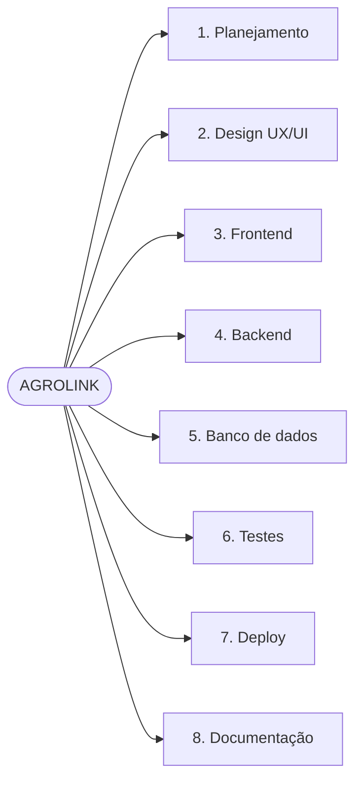

# EAP — Estrutura Analítica do Projeto (AGROLINK)

Decomposição do trabalho em **níveis** (raiz → áreas → pacotes → subpacotes), alinhada ao escopo do Agrolink.  
Inclui **frontend web (React)** além do **mobile (Flutter)**, conforme a arquitetura do repositório.

---

## Diagrama principal (Mermaid)

Visualização em árvore. No GitHub/GitLab, o bloco renderiza automaticamente.

```mermaid
flowchart TB
  AGROLINK([AGROLINK])

  AGROLINK --> P[1. Planejamento]
  P --> P1[Levantamento de requisitos]
  P --> P2[Definição de personas]
  P --> P3[Definição de escopo]
  P --> P4[Cronograma]

  AGROLINK --> D[2. Design UX/UI]
  D --> DW[Wireframes]
  DW --> DW1[Tela de login]
  DW --> DW2[Cadastro]
  DW --> DW3[Dashboard]
  DW --> DW4[Mapa de ocorrências]
  DW --> DW5[Chat / mensagens]
  DW --> DW6[Notificações]
  DW --> DW7[Perfil e configurações]
  D --> DP[Protótipo — Figma]
  D --> DV[Validação de usabilidade]

  AGROLINK --> F[3. Desenvolvimento frontend]
  F --> FW[Web — React]
  FW --> FW1[Autenticação, shell e rotas]
  FW --> FW2[Dashboard, ocorrências, mapa, registrar]
  FW --> FW3[Mensagens, equipe, relatórios, notificações]
  FM[Mobile — Flutter]
  F --> FM
  FM --> FA[Autenticação]
  FA --> FA1[Login]
  FA --> FA2[Cadastro]
  FM --> FD[Dashboard]
  FM --> FO[Mapa de ocorrências]
  FM --> FT[Telas de ocorrências]
  FM --> FC[Chat]
  FC --> FC1[Lista de chats]
  FC --> FC2[Conversa]
  FM --> FN[Notificações]
  FM --> FP[Perfil e configurações]

  AGROLINK --> B[4. Desenvolvimento backend]
  B --> B1[API REST]
  B --> B2[Autenticação e autorização]
  B --> B3[Gerenciamento de usuários]
  B --> B4[Gerenciamento de ocorrências]
  B --> B5[Sistema de chat]
  B --> B6[Sistema de notificações]
  B --> B7[Integração com banco de dados]

  AGROLINK --> BD[5. Banco de dados]
  BD --> BD1[Modelagem — DER]
  BD --> BT[Tabelas]
  BT --> BT1[Usuários]
  BT --> BT2[Ocorrências]
  BT --> BT3[Mensagens]
  BT --> BT4[Notificações]
  BD --> BD2[Queries e otimização]

  AGROLINK --> T[6. Testes]
  T --> T1[Testes unitários]
  T --> T2[Testes de integração]
  T --> T3[Testes de usabilidade]
  T --> T4[Correção de bugs]

  AGROLINK --> S7[7. Deploy]
  S7 --> S7a[Configuração de ambiente]
  S7 --> S7b[Publicação backend]
  S7 --> S7c[Publicação web e mobile]
  S7 --> S7d[Monitoramento]

  AGROLINK --> DOC[8. Documentação]
  DOC --> DOC1[Documentação de requisitos]
  DOC --> DOC2[Documentação de arquitetura]
  DOC --> DOC3[Diagramas]
  DOC --> DOC4[Manual do usuário]
```

---

## Visão só dos 8 eixos (compacta)

Útil para apresentações.

---
