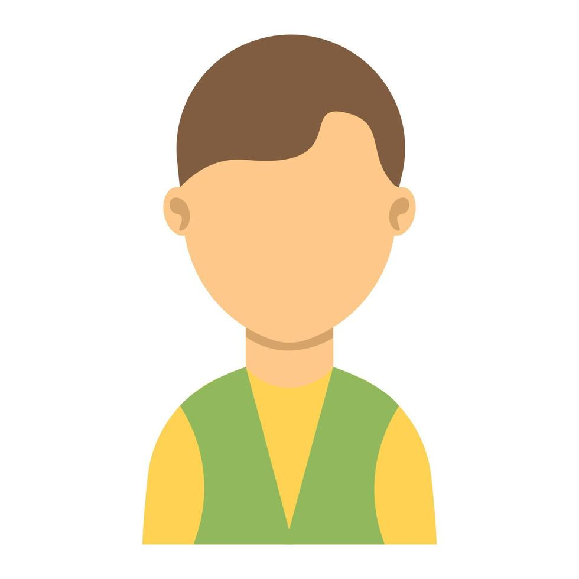

# 2. Nosso Produto

Nosso produto foi desenvolvido para atender produtores e gerentes de fazendas de médio e grande porte, oferecendo uma forma mais inteligente de monitorar e gerenciar as operações rurais. A proposta é centralizar as informações da fazenda em um único sistema, permitindo registrar ocorrências, acompanhar atividades e localizar exatamente onde cada problema aconteceu.
Diferente de ferramentas mais informais, como WhatsApp, planilhas ou anotações soltas, o nosso sistema organiza os dados de forma estruturada e em tempo real. Isso melhora a rastreabilidade das informações, facilita o acompanhamento do histórico de cada situação e torna a gestão muito mais eficiente.
Com isso, o produto ajuda o gestor a tomar decisões mais seguras e rápidas, baseadas em dados concretos, e não apenas em suposições. Ou seja, ele traz mais controle, mais organização e mais precisão para o dia a dia no campo

## 2.1 Visão do Produto
Nosso produto é um sistema inteligente de monitoramento e gestão rural para produtores e gerentes de fazendas de médio e grande porte, que permite controlar ocorrências e operações em tempo real com localização precisa, diferentemente de WhatsApp, planilhas ou comunicação informal, pois centraliza informações, registra histórico estruturado e conecta cada problema a um ponto exato da fazenda, garantindo rastreabilidade e tomada de decisão baseada em dados, e não em suposições.

## 2.2 Nosso Produto
Nosso produto:
É: Nosso produto é um sistema digital de monitoramento e comunicação operacional para fazendas, focado na gestão do campo em tempo real. Ele se posiciona como uma ferramenta estratégica para melhorar a tomada de decisão e reduzir perdas operacionais.

Não É: Ele não é um ERP agrícola completo, nem um sistema financeiro ou contábil. Também não é apenas um aplicativo de chat, pois vai além da troca de mensagens ao estruturar informações e ocorrências.

Faz: O sistema centraliza a comunicação entre produtor e equipe, registra ocorrências com localização via GPS, permite acompanhar tarefas e mantém um histórico organizado dos problemas por área da fazenda.

Não Faz: O sistema centraliza a comunicação entre produtor e equipe, registra ocorrências com localização via GPS, permite acompanhar tarefas e mantém um histórico organizado dos problemas por área da fazenda.

## 2.3 Personas
<h2>Persona 1</h2>
<table>
  <tr>
    <td style="vertical-align: top; width: 150px;">
      
    </td>
    <td style="vertical-align: top; padding-left: 10px;">
      <strong>Nome:</strong> Rodrigo Amaral   
      <strong>Idade:</strong> 46 anos  
      <strong>Hobby:</strong> Fazer trilhas   
      <strong>Trabalho:</strong> Engenheiro agrônomo   
      <strong>Personalidade:</strong> determinado, empreendedor  
      <strong>Sonho:</strong> Iniciar seu empreendimento no setor do agronegócio   
      <strong>Dores:</strong> Dificuldade em planejar e estruturar o funcionamento do seu negócio  
    </td>
  </tr>
</table>
<h2>Persona 2</h2>
<table>
  <tr>
    <td style="vertical-align: top; width: 150px;">
      
    </td>
    <td style="vertical-align: top; padding-left: 10px;">
      <strong>Nome:</strong> Mariana Souza   
      <strong>Idade:</strong> 34 anos  
      <strong>Hobby:</strong> Academia e corrida   
      <strong>Trabalho:</strong> Administradora rural   
      <strong>Personalidade:</strong>  analítica, organizada, detalhista  
      <strong>Sonho:</strong> profissionalizar a gestão da fazenda com uso de tecnologia   
      <strong>Dores:</strong> Falta de dados organizados e dificuldade em tomar decisões baseadas em informações confiáveis  
    </td>
  </tr>
</table>

