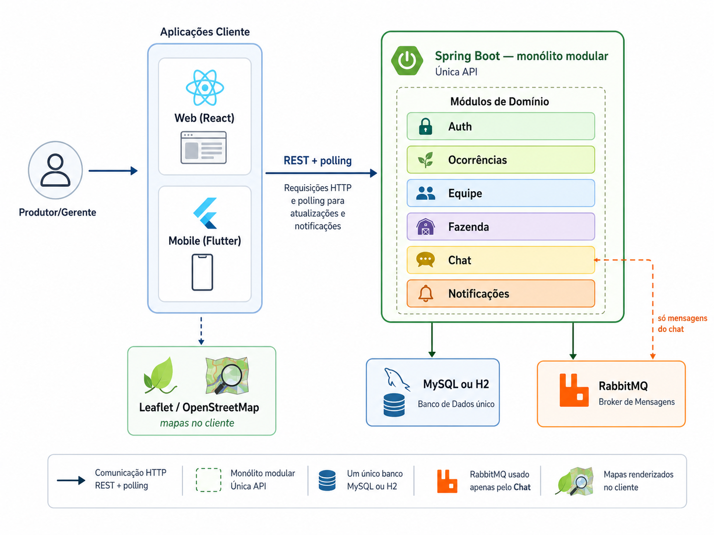
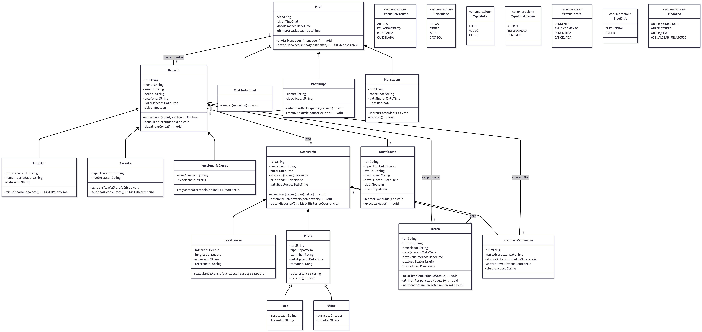
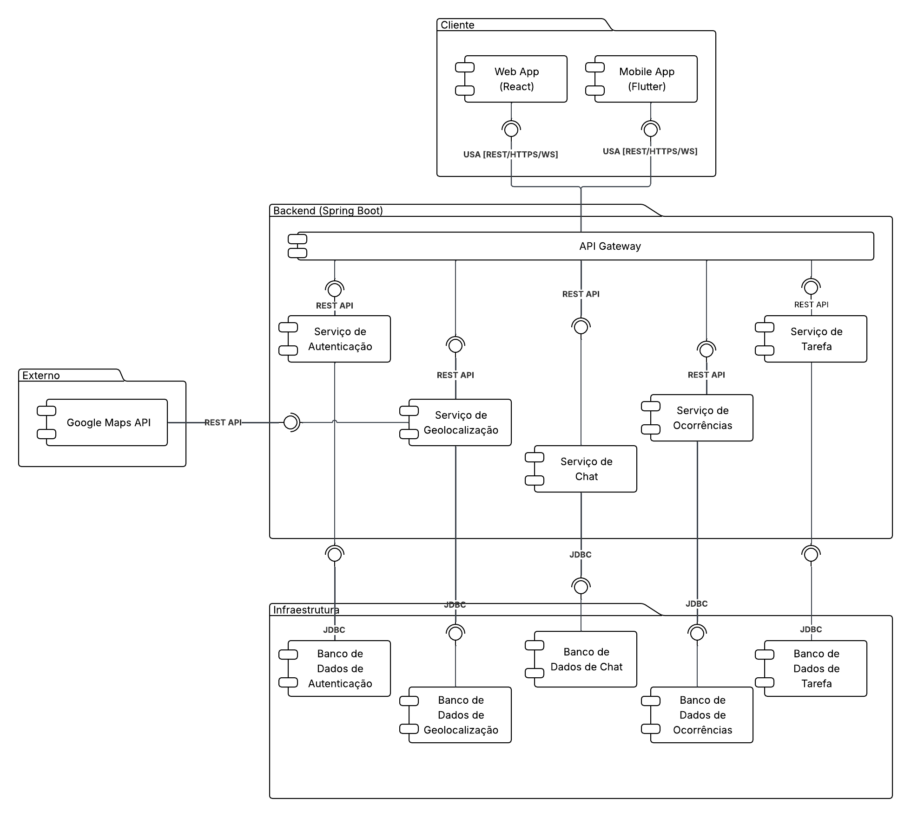

# 7. Avaliação da Arquitetura

_Esta seção descreve a avaliação da arquitetura apresentada, baseada no método **ATAM** (Architecture Tradeoff Analysis Method). O ATAM estrutura a análise em torno de **cenários de atributos de qualidade** — estímulos, respostas esperadas e mecanismos arquiteturais — identificando riscos, pontos de sensibilidade e tradeoffs entre decisões de projeto._

A arquitetura avaliada é a descrita em [`docs/4.modelagem.md`](4.modelagem.md) e implementada no monorepo [`code/`](../code/): clientes **React** (web) e **Flutter** (mobile) consumindo um back-end monolítico **Spring Boot** com persistência **H2/MySQL**, comunicação **REST** e suporte a operação offline parcial (web e mobile).

## 7.1. Cenários

_Cada cenário segue o formato de cenário de atributo de qualidade do ATAM: **fonte** do estímulo, **estímulo**, **ambiente**, **artefato** afetado, **resposta** esperada e **medida de resposta**. Os cenários foram escolhidos para exercitar os requisitos não funcionais definidos em [`docs/3.requisitos.md`](3.requisitos.md)._

**Cenário 1 — Desempenho (RNF002):** Um funcionário de campo autenticado consulta a lista de ocorrências da fazenda pelo aplicativo mobile em condições normais de uso (rede estável, servidor local ou em nuvem). O estímulo é uma requisição `GET /api/ocorrencias` após login. A arquitetura deve entregar os dados em tempo aceitável para uso operacional. **Medida de resposta:** tempo de resposta da API até **2 segundos** em condições normais.

**Cenário 2 — Usabilidade (RNF006):** Um trabalhador rural com pouca familiaridade com tecnologia acessa o sistema web para registrar e acompanhar ocorrências (login, dashboard, mapa, formulários). O estímulo é a navegação pelas telas principais sem treinamento formal. A interface deve ser compreensível e oferecer feedback claro. **Medida de resposta:** conclusão das tarefas frequentes com fluxos curtos e mensagens de erro compreensíveis; avaliação heurística favorável nas telas críticas.

**Cenário 3 — Interoperabilidade:** O mesmo back-end atende simultaneamente o cliente web (React/Vite) e o cliente mobile (Flutter), ambos realizando cadastro, login e registro de ocorrências. O estímulo é o consumo dos endpoints `/api/auth/*`, `/api/ocorrencias/*` e `/api/fazenda/*` com corpos JSON e códigos HTTP padronizados. **Medida de resposta:** contrato REST estável, sem formatos proprietários por plataforma; clientes operam com a mesma base de URL e semântica de status (200, 201, 400, 401, 403, 404, 409).

**Cenário 4 — Manutenibilidade:** A equipe de desenvolvimento precisa evoluir regras de negócio de ocorrências e isolamento por fazenda sem impactar toda a aplicação. O estímulo é uma alteração em regras de visibilidade ou atribuição de responsáveis. A arquitetura em camadas deve concentrar a lógica em componentes substituíveis. **Medida de resposta:** mudanças localizadas em services do back-end; clientes permanecem desacoplados da regra de negócio via API REST.

**Cenário 5 — Segurança (RNF003):** Um usuário não autenticado ou com credenciais inválidas tenta acessar recursos restritos (listagem de ocorrências, dados de outra fazenda). O estímulo é requisição sem token ou com token inválido/expirado. **Medida de resposta:** acesso negado (HTTP 401/403); senhas nunca armazenadas em texto claro; cada usuário acessa apenas recursos compatíveis com seu papel e vínculo com a fazenda.

**Cenário 6 — Isolamento multi-tenant (RNF004):** Dois gerentes de fazendas distintas operam o sistema ao mesmo tempo. O estímulo é consulta de ocorrências, mapa e equipe. A arquitetura deve impedir vazamento de dados entre propriedades rurais. **Medida de resposta:** ocorrências, setores e membros retornados pertencem exclusivamente à fazenda vinculada ao usuário autenticado.

**Cenário 7 — Disponibilidade em campo / offline (RNF001):** Um funcionário perde conectividade durante o registro de ocorrência no mobile ou na web. O estímulo é criação de ocorrência sem rede. A arquitetura deve permitir continuidade operacional e sincronização posterior. **Medida de resposta:** registro persistido localmente (cache/outbox), sincronização automática ao restabelecer a conexão, sem duplicação de registros no servidor.

## 7.2. Avaliação

_Para cada cenário prioritário, apresentam-se a análise ATAM: requisito de qualidade, preocupação dos stakeholders, mecanismo arquitetural que endereça o cenário, medida de resposta observada na implementação atual e considerações (riscos, sensibilidade e tradeoffs)._

### Cenário 1 — Desempenho

| **Atributo de Qualidade:** | Desempenho |
| --- | --- |
| **Requisito de Qualidade** | O tempo de resposta das operações não deve ultrapassar 2 segundos em condições normais de uso (**RNF002**). |
| **Preocupação:** | Operações de consulta e autenticação devem ser rápidas o suficiente para uso em campo e no escritório rural, sem bloquear o fluxo de trabalho. |
| **Cenário(s):** | Cenário 1 |
| **Ambiente:** | Operação normal: Spring Boot, MySQL (ou H2 em desenvolvimento), um cliente HTTP por requisição. |
| **Estímulo:** | Consulta de ocorrências ou health check após autenticação. |
| **Mecanismo:** | API REST enxuta (controllers → services → repositórios JPA); pool de conexões **HikariCP**; proxy Vite no web (`/api` → `:8080`); mobile acessa `API_BASE_URL` diretamente; consultas filtradas por `fazendaVinculoId` reduzem volume de dados. |
| **Medida de Resposta:** | Em ambiente local, endpoints leves (`GET /api/health`) respondem em dezenas de milissegundos. Operações de leitura com JPA atendem ao uso acadêmico e demonstrativo. **RNF005** (múltiplos usuários simultâneos) e teste de carga formal ainda não foram exercitados — risco de degradação sob concorrência elevada. |

**Considerações sobre a arquitetura (Desempenho):**

| **Riscos:** | Degradação com muitos usuários simultâneos, uploads de mídia volumosos ou consultas sem paginação adequada. |
| --- | --- |
| **Pontos de Sensibilidade:** | Listagem de ocorrências com filtros; geração de relatórios PDF; sincronização em lote após período offline. |
| **Tradeoff:** | Monólito Spring Boot simplifica latência e deploy em ambiente acadêmico, mas concentra escalabilidade vertical; microsserviços do diagrama de componentes (Figura 3) não foram implementados — ganho em simplicidade, perda em escalabilidade horizontal independente. |

### Cenário 2 — Usabilidade

| **Atributo de Qualidade:** | Usabilidade |
| --- | --- |
| **Requisito de Qualidade** | Interface simples e intuitiva para trabalhadores rurais (**RNF006**). |
| **Preocupação:** | Telas devem ser compreensíveis sem treinamento prolongado; tarefas frequentes (login, registrar ocorrência, consultar mapa) devem exigir poucos passos. |
| **Cenário(s):** | Cenário 2 |
| **Ambiente:** | Navegador (SPA React) e app Flutter (Android, emulador ou web via Chrome). |
| **Estímulo:** | Usuário navega pelas telas principais e tenta concluir tarefas operacionais. |
| **Mecanismo:** | Design system compartilhado conceitualmente (tokens CSS no web, `AppTokens` no mobile); wireframes em [`docs/5.wireframe.md`](5.wireframe.md); `AppShell` e navegação por abas; feedback de erro em formulários; banner de status offline na web. |
| **Medida de Resposta:** | Web validada nas sprints 4–5 com wireframes implementados. Avaliação heurística documentada em `assets/AGROLINK - Avaliação Heuristica.pdf`. Mobile em maturação na sprint 6 — paridade visual e de fluxo ainda em evolução. |

**Considerações sobre a arquitetura (Usabilidade):**

| **Riscos:** | Divergência de experiência entre web e mobile; complexidade do mapa interativo em telas pequenas. |
| --- | --- |
| **Pontos de Sensibilidade:** | Registro de ocorrência em campo (formulário + GPS + anexos); legibilidade em dispositivos de entrada de baixo custo. |
| **Tradeoff:** | Duas stacks de UI (React + Flutter) permitem experiência nativa em cada plataforma, mas duplicam esforço de design e manutenção de telas equivalentes. |

### Cenário 3 — Interoperabilidade

| **Atributo de Qualidade:** | Interoperabilidade |
| --- | --- |
| **Requisito de Qualidade** | Clientes distintos devem consumir a mesma API REST com contrato estável e padrões abertos (HTTP/JSON). |
| **Preocupação:** | Web e mobile não devem depender de protocolos ou formatos proprietários; evolução do back-end não deve exigir reescrita total dos clientes. |
| **Cenário(s):** | Cenário 3 |
| **Ambiente:** | Back-end Spring Boot único; clientes em redes distintas (proxy local vs. emulador `10.0.2.2` vs. `127.0.0.1`). |
| **Estímulo:** | Cadastro, login e CRUD de ocorrências a partir de React e Flutter. |
| **Mecanismo:** | Controllers REST (`AuthController`, `OcorrenciaController`, `FazendaController`, etc.); DTOs JSON; status HTTP semânticos; web via proxy Vite; mobile via `--dart-define=API_BASE_URL`; documentação de contrato implícita nos DTOs e READMEs do monorepo. |
| **Medida de Resposta:** | Ambos os clientes autenticam, listam ocorrências e interagem com a mesma API sem adaptadores intermediários. Restrição arquitetural RESTful (**seção 3.3**) atendida na implementação atual. |

**Considerações sobre a arquitetura (Interoperabilidade):**

| **Riscos:** | Ausência de especificação OpenAPI versionada; mudanças em DTOs podem quebrar clientes silenciosamente. |
| --- | --- |
| **Pontos de Sensibilidade:** | Upload multipart de imagens; campo `clientUuid` para idempotência offline; configuração de URL base no mobile conforme alvo (emulador, dispositivo físico, Chrome). |
| **Tradeoff:** | API única reduz complexidade operacional e garante paridade funcional, mas concentra o acoplamento dos clientes em um único ponto de evolução. |

### Cenário 4 — Manutenibilidade

| **Atributo de Qualidade:** | Manutenibilidade |
| --- | --- |
| **Requisito de Qualidade** | O sistema deve permitir evolução das regras de negócio com impacto localizado e separação clara de responsabilidades. |
| **Preocupação:** | Alterações em ocorrências, fazenda, equipe e autenticação não devem espalhar lógica pelos clientes nem misturar persistência com regra de negócio. |
| **Cenário(s):** | Cenário 4 |
| **Ambiente:** | Monorepo com três módulos (`back`, `front`, `mobile`); equipe acadêmica em sprints iterativas. |
| **Estímulo:** | Mudança em regra de visibilidade de ocorrências ou atribuição de responsável. |
| **Mecanismo:** | Back-end em camadas (controller / service / repository) com injeção de dependências Spring; regras centralizadas em `OcorrenciaService`, `FazendaService`, `FazendaAcessoService`; clientes como consumidores finos da API; mecanismos arquiteturais de [`docs/3.requisitos.md`](3.requisitos.md) (ORM/JPA, SPA, API REST). |
| **Medida de Resposta:** | Estrutura de pacotes coerente (`api`, `service`, `repository`, `domain`, `dto`); seeds demo (`DemoTeamSeed`, `DemoFazendaSeed`) isolados em `config`; documentação por módulo em `code/*/README.md`. |

**Considerações sobre a arquitetura (Manutenibilidade):**

| **Riscos:** | Lógica de sincronização offline distribuída entre web (`OfflineSyncProvider`) e mobile (`offline_db.dart`); divergência de comportamento entre clientes. |
| --- | --- |
| **Pontos de Sensibilidade:** | Regras de `fazendaVinculoId` e papel de usuário; evolução do contrato REST sem versionamento (`/api/v1`). |
| **Tradeoff:** | Monólito modular no back-end facilita refatoração interna, mas o front duplo (React + Flutter) aumenta o custo de manter paridade funcional a cada nova regra exposta na API. |

### Cenário 5 — Segurança

| **Atributo de Qualidade:** | Segurança |
| --- | --- |
| **Requisito de Qualidade** | Acesso aos recursos restritos deve ser controlado (**RNF003**); cadastro e autenticação de usuários (**RF001**). |
| **Preocupação:** | Cada usuário deve acessar apenas recursos condizentes com credenciais, papel (produtor, gerente, funcionário) e vínculo com a fazenda. |
| **Cenário(s):** | Cenário 5 |
| **Ambiente:** | Sistema em operação normal; clientes armazenam token localmente após login. |
| **Estímulo:** | Tentativa de login com senha incorreta; requisição autenticada a recurso de outra fazenda; cadastro com e-mail duplicado. |
| **Mecanismo:** | `AuthService` valida credenciais e aplica **BCrypt** (`PasswordEncoder`); token retornado em `AuthResponse` no formato `agrolink-{id}`; clientes enviam `Authorization: Bearer`; `AgrolinkBearerToken` extrai o usuário; services aplicam regras de acesso por fazenda. |
| **Medida de Resposta:** | Credenciais inválidas e contas inativas são rejeitadas; senhas persistidas com hash; isolamento por fazenda exercitado nos services de domínio. Token MVP não utiliza JWT/OAuth — adequado ao escopo acadêmico, insuficiente para produção sem endurecimento. |

**Considerações sobre a arquitetura (Segurança):**

| **Riscos:** | Token previsível e sem expiração/assinatura; armazenamento local do token em web/mobile; uploads em disco local (`back/uploads/`) sem política de acesso em nuvem (**RNF008** pendente). |
| --- | --- |
| **Pontos de Sensibilidade:** | Endpoints que dependem exclusivamente da validação no service (sem filtro global Spring Security); multi-tenant (**RNF004**). |
| **Tradeoff:** | Token simplificado `agrolink-{id}` acelera integração dos três módulos no prazo da disciplina, em detrimento de confidencialidade, revogação e padrões de mercado (JWT, refresh token). |

### Cenário 6 — Isolamento multi-tenant

| **Atributo de Qualidade:** | Segurança / Disponibilidade de dados |
| --- | --- |
| **Requisito de Qualidade** | Dados das fazendas isolados entre si (**RNF004**). |
| **Preocupação:** | Vazamento de ocorrências, setores ou membros entre propriedades distintas comprometeria a confiança no sistema. |
| **Cenário(s):** | Cenário 6 |
| **Ambiente:** | Múltiplos gerentes e funcionários vinculados a fazendas diferentes no mesmo banco MySQL. |
| **Estímulo:** | Consulta de ocorrências, mapa e equipe após autenticação. |
| **Mecanismo:** | Campo `fazendaVinculoId` em `Usuario`; `FazendaAcessoService` verifica vínculo (gerente via `Fazenda.gerenteUsuarioId`, demais papéis via convite aceito); queries de `OcorrenciaService` e `FazendaService` filtradas pela fazenda do usuário autenticado. |
| **Medida de Resposta:** | Isolamento lógico implementado no nível de aplicação (single database, tenant por `fazendaId`). Não há separação física por schema ou banco por tenant — adequado ao MVP, com dependência forte da correção das queries em todos os endpoints. |

**Considerações sobre a arquitetura (Multi-tenant):**

| **Riscos:** | Novo endpoint sem filtro por fazenda pode expor dados cruzados; ausência de row-level security no banco. |
| --- | --- |
| **Pontos de Sensibilidade:** | Convites de equipe; migração de usuários entre fazendas; seeds demo que reapontam vínculos. |
| **Tradeoff:** | Multi-tenancy lógico em monólito compartilhado reduz custo de infraestrutura frente a *database per service* do diagrama alvo, mas exige disciplina rigorosa em toda camada de persistência. |

### Cenário 7 — Disponibilidade offline

| **Atributo de Qualidade:** | Disponibilidade / Modificabilidade |
| --- | --- |
| **Requisito de Qualidade** | Funcionamento offline no mobile com sincronização automática (**RNF001**). |
| **Preocupação:** | Em áreas rurais com conectividade instável, o funcionário não pode perder registros de ocorrência. |
| **Cenário(s):** | Cenário 7 |
| **Ambiente:** | Mobile Flutter ou web React sem conectividade; posterior reconexão à API. |
| **Estímulo:** | Criação de ocorrência (com GPS e anexos opcionais) durante indisponibilidade de rede. |
| **Mecanismo:** | Padrão **cache local + outbox + sync incremental** (`code/OFFLINE.md`): web usa `OfflineSyncProvider` e `localStorage`; mobile usa `offline_db.dart`, fila de sincronização e `clientUuid` no servidor para idempotência; detecção de conectividade (`connectivity` / eventos `online`/`offline`). |
| **Medida de Resposta:** | Web e mobile permitem registrar ocorrências offline e exibir indicador de pendências; sincronização ao reconectar. Escopo parcial: resolução/comentário offline limitado; **RNF001** ainda marcado como em evolução no quadro de requisitos. |

**Considerações sobre a arquitetura (Offline):**

| **Riscos:** | Conflitos de sincronização; duplicação se `clientUuid` não for respeitado; anexos grandes em fila local. |
| --- | --- |
| **Pontos de Sensibilidade:** | Tamanho do cache; ordem de replay da outbox; consistência entre web e mobile após sync. |
| **Tradeoff:** | Offline-first aumenta disponibilidade em campo, mas introduz complexidade de consistência eventual e duplicação de lógica de sync nos dois clientes — tradeoff clássico entre **disponibilidade** e **simplicidade de implementação**. |

### Avaliação geral da arquitetura

**Pontos fortes**

- Arquitetura cliente-servidor clara, com **API REST única** consumida por web e mobile — forte interoperabilidade e alinhamento à restrição RESTful.
- Back-end **monolito modular** com separação controller/service/repository, facilitando manutenção e concentração das regras de negócio.
- Mecanismos de **segurança básica** (BCrypt, Bearer token, filtro por fazenda) e **suporte offline** parcial endereçam preocupações centrais do domínio rural.
- Documentação e diagramas ([`docs/4.modelagem.md`](4.modelagem.md), wireframes, READMEs do monorepo) sustentam rastreabilidade entre decisão arquitetural e implementação.

**Limitações identificadas pelo ATAM**

- Divergência entre **arquitetura alvo** (microsserviços, API Gateway, WebSocket, Google Maps) e **implementação atual** (monólito, polling HTTP, Leaflet/OSM) — tradeoffs conscientes de escopo acadêmico, mas com débito arquitetural documentado.
- **RNF002** e **RNF005** sem validação formal sob carga; desempenho inferido apenas em uso local.
- **RNF003** e **RNF004** parcialmente atendidos — token MVP e multi-tenancy lógico sem isolamento físico.
- **RNF008** (armazenamento em nuvem) não implementado; mídias em disco local.
- Paridade e maturação do **mobile Flutter** ainda em evolução (**RNF006**, **RNF007**).

**Síntese dos tradeoffs principais**

| Decisão | Benefício | Custo |
| --- | --- | --- |
| Monólito Spring Boot em vez de microsserviços | Simplicidade, menor latência em dev, deploy único | Escalabilidade horizontal limitada; acoplamento de módulos no mesmo processo |
| API REST única para web e mobile | Interoperabilidade, uma fonte de verdade | Evolução de contrato impacta dois clientes |
| React + Flutter | UX adequada por plataforma | Duplicação de telas e lógica offline |
| Token `agrolink-{id}` | Integração rápida | Segurança abaixo do padrão de produção |
| Multi-tenant lógico (single DB) | Infraestrutura simples | Risco de vazamento se filtro omitido em novo endpoint |
| Offline-first nos clientes | Disponibilidade em campo | Consistência eventual e complexidade de sync |

## Evidências da avaliação arquitetural

_As evidências abaixo sustentam a análise ATAM por **inspeção da arquitetura e do código**, não por suíte de testes automatizados. As imagens foram incluídas para reforçar a rastreabilidade visual entre arquitetura, implementação e artefatos de interface._

| Evidência | Imagem de evidência | Artefato / observação |
| --- | --- | --- |
| Visão cliente-servidor e componentes |  | [`docs/4.modelagem.md`](4.modelagem.md) — Figuras 1 a 3 |
| Diagrama de classes |  | Modelo de domínio, papéis de usuário e relações principais |
| Diagrama de componentes |  | Arquitetura de clientes, backend, infraestrutura e integrações |
| Fluxo de autenticação |  | Tela de login e acesso autenticado; referência a [`docs/5.wireframe.md`](5.wireframe.md) |
| Registro e acompanhamento de ocorrências |  | Fluxo de cadastro e visualização de ocorrências no contexto operacional |
| Experiência mobile e offline |  | Evidência visual do uso mobile para registro de ocorrências em campo |

_A avaliação ATAM conclui que a arquitetura implementada atende de forma **satisfatória** os cenários de interoperabilidade, manutenibilidade estrutural e usabilidade web no escopo acadêmico; atende de forma **parcial** desempenho sob carga, segurança avançada, multi-tenancy rigoroso e operação offline completa — com riscos e tradeoffs explicitados acima para orientar evoluções futuras (JWT, OpenAPI, teste de carga, cloud storage, WebSocket)._
